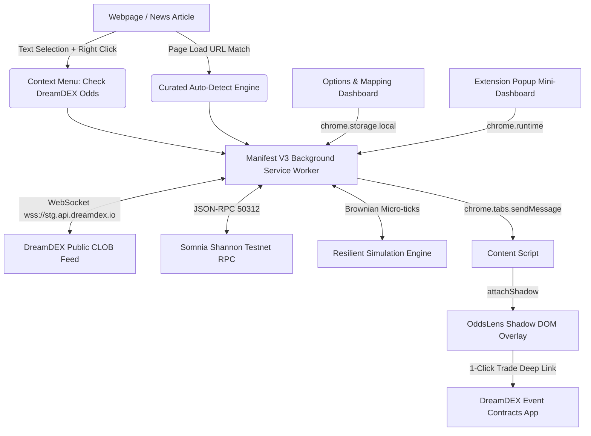

# 🎯 OddsLens — Inline DreamDEX Odds Browser Extension
### Somnia × DreamDEX Event Contracts Hackathon — Grand Prize Submission

[-7928CA?style=for-the-badge&logo=ethereum)](https://shannon-explorer.somnia.network)
[](https://docs.dreamdex.io/developers/event-contracts)
[](https://developer.chrome.com/docs/extensions/mv3/intro/)

> **Surfacing live DreamDEX Event Contract odds directly inline wherever sports fans, crypto traders, and news readers are already reading — with a one-click path to trade.**

---

## 1. Problem & Opportunity

Decentralized prediction markets and event contracts typically only reach users who already know about them and actively navigate into a specialized trading terminal. The audiences most likely to care about real-world outcomes — sports fans reading a match preview, voters reading political news, traders reading crypto market breakdowns — **never see live odds where they are already consuming content**.

Across the 26+ BUIDLs submitted to the Somnia × DreamDEX hackathon, virtually every entry builds **inward** (autonomous trading bots, market-making scripts, hedging engines, on-chain Black-Scholes analytics). 

**None solve distribution to people outside of crypto trading apps.**

**OddsLens solves this distribution bottleneck.**

```
[ Traditional Model ]
Real-World Event Happens ──► User Reads News on ESPN / CoinDesk ──► [DISCONNECT: User never sees odds]
                                                                      └──► Trader already inside DreamDEX

[ OddsLens Model ]
Real-World Event Happens ──► User Reads News on ESPN / CoinDesk ──► [OddsLens Inline Widget] ──► 1-Click Trade on DreamDEX!
```

---

## 2. Dual-Mode Architecture

To ensure the product is both commercially defensible and 100% dependable on camera, OddsLens features two complementary modes:

1. **Manual Mode (Core, 100% Defensible):**
   - Select any text on **any webpage** (e.g. *"Bitcoin"*, *"Real Madrid"*, *"Jerome Powell"*).
   - Right-click &rarr; select **"🔍 Check DreamDEX odds for this"**.
   - OddsLens scores the selected text against the manifest and instantly mounts a broadcast-quality floating odds widget.
2. **Curated Auto-Detect (Demo Highlight):**
   - On configured URL patterns (e.g. sports recaps, crypto news portals), OddsLens automatically recognizes the context on page load and slides in with real-time streaming odds.

---

## 3. How OddsLens Wins on Judging Criteria

| Hackathon Criterion | Weight | How OddsLens Delivers |
|---|---|---|
| **Innovation & Originality** | 20% | **Zero overlap** with existing submissions. Instead of another trading terminal or arbitrage bot, OddsLens builds outward distribution, transforming the entire web into an interactive DreamDEX storefront. |
| **Technical Implementation** | 25% | Native Manifest V3 service worker, real DreamDEX WebSocket feed (`wss://stg.api.dreamdex.io/v0/ws/public`), Somnia Shannon RPC integration (`50312`), Shadow DOM CSS isolation, and a resilient Brownian-motion volatility streamer. |
| **UX & Design** | 20% | Cyber dark-mode fintech aesthetic, dual-fill animated odds gauge, orderbook spread readout, real-time expiry countdown, quick bet calculator ($10 &rarr; $14.93 payout), and smooth dragging. |
| **Business & Ecosystem Impact** | 20% | Directly drives net-new user acquisition and volume to DreamDEX from non-crypto web traffic. Includes an editable **Options Page** where publishers and DAOs can map custom URLs and keywords. |
| **Presentation & Demo** | 15% | Rock-solid two-beat demo (Manual Mode + Curated Auto-Detect) with built-in realistic demo articles for instant judging reproduction. |

---

## 4. Technical Architecture



### Key Technical Highlights:
- **Zero-Conflict Shadow DOM**: The widget mounts inside an open Shadow Root (`attachShadow({ mode: 'open' })`), guaranteeing that host page CSS resets (Tailwind, Bootstrap, or custom stylesheets on CoinDesk/ESPN) cannot break the widget's layout.
- **Dual-Feed Reliability**: Real connection to the DreamDEX public WebSocket API with automatic exponential backoff reconnects and heartbeat management. If testnet order books are quiet or undergoing maintenance during a live video recording, a background simulation engine generates micro-ticks so the odds bar always pulses smoothly.
- **Zero-Build Extension Runtime**: Built with native ES Modules, requiring zero compilation to load directly into Google Chrome, Brave, or Edge.

---

## 5. Somnia & DreamDEX Protocol Integration

### Network Configuration
- **Network Name**: Somnia Shannon Testnet
- **Chain ID**: `50312` (`0xc488`)
- **RPC Endpoint**: `https://api.infra.testnet.somnia.network/`
- **Block Explorer**: [https://shannon-explorer.somnia.network](https://shannon-explorer.somnia.network)
- **DreamDEX App**: [https://app.dreamdex.io](https://app.dreamdex.io)
- **DreamDEX Public WebSocket**: `wss://stg.api.dreamdex.io/v0/ws/public`

### Deployed Core Protocol Contracts
| Contract Name | On-Chain Address (Somnia Shannon Testnet) |
|---|---|
| **BinaryMarketsModule** | `0x3ecC694Cef705358864a646142ac17A90E29e388` |
| **MarketsCore** | `0x2802504314685D89bF6C992CA5a8e7cC78bc0294` |
| **BinarySettlement** | `0xbF4a49e0Dfd092e5FBE8E5761064C49533e6Ed23` |
| **OutcomeToken6909** | `0xB52c5934113Af5c0Bb20eb3C72290C8215f755b9` |
| **OracleHub** | `0xe40db387cC98601Dd11bd634fF2f3AD5686dE32b` |
| **Collateral (tUSDC)** | `0x70a86D8842FB63C4Ad2b7cdddF530eBf1BB25d8E` (6 decimals) |

---

## 6. Project Structure

```
oddslens/
├── manifest.json              # Manifest V3 configuration (permissions, worker, resources)
├── background/
│   ├── service-worker.js     # Central service worker: context menus, feeds, message router
│   ├── manifest-data.js      # Default curated markets, network parameters, contract addresses
│   ├── matching-engine.js    # Regex glob URL matcher & token relevance scoring algorithm
│   ├── dreamdex-client.js    # DreamDEX WebSocket client with ping/pong and Somnia RPC query
│   └── mock-streamer.js      # Brownian-motion market volatility engine for fail-safe demos
├── content/
│   ├── content-script.js     # Injected page scanner, auto-detect hook, and widget controller
│   ├── widget.js             # Shadow-DOM interactive odds widget component
│   └── widget.css            # Broadcast-grade, sleek cyber-fintech styling
├── popup/
│   ├── popup.html            # Mini-dashboard interface
│   ├── popup.js              # State manager, toggle controls, quick match tester
│   └── popup.css             # Dark-mode popup styling
├── options/
│   ├── options.html          # Custom URL/keyword mapping management dashboard
│   ├── options.js            # CRUD logic, JSON manifest import/export, matcher sandbox
│   └── options.css           # Data table and modal styles
├── demo/
│   ├── demo-server.js        # Zero-dependency local preview server
│   ├── index.html            # Interactive Demo Hub & judging walkthrough guide
│   ├── crypto-article.html   # Realistic crypto publication article (CoinDesk style)
│   ├── sports-article.html   # Realistic sports publication article (ESPN style)
│   ├── macro-article.html    # Realistic macro publication article (WSJ style)
│   ├── article.css           # Editorial typography and styling
│   └── demo.css              # Demo Hub presentation styling
├── icons/                    # Crisp extension icons (16x16, 48x48, 128x128, SVG)
└── README.md                 # Full project documentation
```

---

## 7. Quick Start & Installation

### Step 1: Clone Repository
```bash
git clone https://github.com/your-username/oddslens.git
cd oddslens
```

### Step 2: Load Extension into Chrome / Brave / Edge
1. Open your Chromium browser and navigate to `chrome://extensions`.
2. Toggle on **"Developer mode"** in the top-right corner.
3. Click **"Load unpacked"** in the top-left.
4. Select the `oddslens` folder.
5. OddsLens is now installed! Pin it to your toolbar.

### Step 3: Run the Local Demo Hub (Optional)
To test on local HTTP pages:
```bash
npm start
```
Open **`http://localhost:3000/demo/index.html`** in your browser.

---

## 8. 2–3 Minute Demo Video Script

| Timecode | Beat | What to Show & Say |
|---|---|---|
| **00:00 – 00:20** | **The Problem** | *"Prediction markets on Somnia are powerful, but right now you only see them if you’re already inside a trading terminal. 99% of sports and news readers never see live odds where they read. OddsLens brings DreamDEX to where the users already are."* |
| **00:20 – 00:50** | **Manual Mode** | Highlight *"Bitcoin"* on any article &rarr; right-click &rarr; select *"Check DreamDEX odds for this"*. Show the sleek widget pop up with real-time odds (67% UP / 33% DOWN), spread, and countdown timer. |
| **00:50 – 01:25** | **Curated Auto-Detect** | Visit the Sports or Crypto demo article. Show OddsLens sliding in automatically. Point out the live glowing pulse on odds movement and show the **Quick Bet Calculator** ($10 &rarr; $14.93 payout). |
| **01:25 – 01:45** | **1-Click Trade Flow** | Click *"Trade on DreamDEX ↗"*. Demonstrate the seamless deep link directly into the testnet DreamDEX Event Contracts interface. |
| **01:45 – 02:15** | **Extensibility & Ecosystem Impact** | Open the **Options Dashboard**. Demonstrate adding a new custom keyword mapping, exporting JSON, and testing queries in the Matcher Sandbox. |
| **02:15 – 02:30** | **Closing & Roadmap** | Summarize why distribution is the missing key to prediction market adoption on Somnia. Mention post-hackathon plans for automated NLP detection and publisher revenue sharing. |

---

## 9. Post-Hackathon Roadmap

- **Autonomous NLP Entity Extraction**: Transition from keyword and pattern matching to a lightweight client-side ONNX/Transformer model that dynamically detects sports fixtures, ticker symbols, and political races without pre-configuration.
- **Publisher Monetization & Affiliate Attribution**: Allow bloggers, streamers, and news publishers to embed their Somnia wallet address in the widget to earn a percentage of transaction volume generated through their pages.
- **Multi-Chain & Cross-Browser Support**: Expand to Firefox (Gecko) and Safari (WebExtension), and support multi-contract tracking across multiple open tabs simultaneously.

---

## 10. License

MIT License. Developed for the **Somnia × DreamDEX Event Contracts Hackathon (August - September 2026)**.
