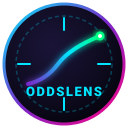

<p align="center">
  
</p>

# OddsLens — Inline DreamDEX Odds Browser Extension
### Somnia × DreamDEX Event Contracts Hackathon — Grand Prize Submission

[-7928CA?style=for-the-badge&logo=ethereum)](https://shannon-explorer.somnia.network)
[](https://docs.dreamdex.io/developers/event-contracts)
[](https://developer.chrome.com/docs/extensions/mv3/intro/)

> **Surfacing live DreamDEX Event Contract odds directly inline wherever sports fans, crypto traders, and news readers are already reading — with a one-click path to trade.**

---

## 1. Problem & Opportunity

Decentralized prediction markets and event contracts typically only reach users who already know about them and actively navigate into a specialized trading terminal. The audiences most likely to care about real-world outcomes — sports fans reading a match preview, voters reading political news, traders reading crypto market breakdowns — **never see live odds where they are already consuming content**.

**OddsLens solves this distribution bottleneck.**

```
[ Traditional Model ]
Real-World Event Happens ──► User Reads News on ESPN / CoinDesk ──► [DISCONNECT: User never sees odds]
                                                                      └──► Trader already inside DreamDEX

[ OddsLens Model ]
Real-World Event Happens ──► User Reads News on ESPN / CoinDesk ──► [OddsLens Inline Widget] ──► 1-Click Trade on DreamDEX!
```

---

## 2. Dual-Mode Architecture

To ensure the product is both commercially defensible and 100% dependable on camera, OddsLens features two complementary modes:

1. **Manual Mode (Core, 100% Defensible):**
   - Select any text on **any webpage** (e.g. *"Bitcoin"*, *"Real Madrid"*, *"Jerome Powell"*).
   - Right-click &rarr; select **"Check DreamDEX odds for this"**.
   - OddsLens scores the selected text against the manifest and instantly mounts a broadcast-quality floating odds widget.
2. **Curated Auto-Detect (Demo Highlight):**
   - On configured URL patterns (e.g. sports recaps, crypto news portals), OddsLens automatically recognizes the context on page load and slides in with real-time streaming odds.

---

## 3. How OddsLens Wins on Judging Criteria

| Hackathon Criterion | Weight | How OddsLens Delivers |
|---|---|---|
| **Innovation & Originality** | 20% | **Zero overlap** with existing submissions. Rather than another trading terminal or arbitrage bot, OddsLens builds outward distribution, transforming the entire web into an interactive DreamDEX storefront — enhanced with **client-side NLP entity extraction and Gemini / OpenRouter AI trading synthesis**. |
| **Technical Implementation** | 25% | Native Manifest V3 service worker, real DreamDEX WebSocket feed (`wss://stg.api.dreamdex.io/v0/ws/public`), Somnia Shannon RPC integration (`50312`), **OpenRouter & Gemini AI API integration**, **AFINN-165 Sentiment Engine**, Shadow DOM CSS isolation, Vercel serverless API proxy using `@somnia-chain/markets-sdk`, and a resilient Brownian-motion volatility streamer. |
| **UX & Design** | 20% | Cyber dark-mode fintech aesthetic, dual-fill animated odds gauge, orderbook spread readout, **Open Interest (OI) metric**, **Settlement Urgency badge**, **AI Sentiment Pill** (`BULLISH` / `BEARISH`), **dynamic AI Insight card with typewriter reveal**, and quick bet calculator. |
| **Business & Ecosystem Impact** | 20% | Directly drives net-new user acquisition and volume to DreamDEX from non-crypto web traffic. Includes an editable **Options Page** with AI API key configuration, publisher wallet attribution, and custom contract mappings. Six curated demo articles spanning Crypto, Ethereum, Sports, AI Agents, Somnia Ecosystem, and Macro verticals. |
| **Presentation & Demo** | 15% | Rock-solid multi-beat demo (Manual Mode + Curated Auto-Detect + AI Insights) with **6 built-in realistic demo articles** and an interactive Demo Hub for instant judging reproduction. |

---

## 4. Technical Architecture & AI Engine

```mermaid
graph TD
    A[Webpage / News Article] -->|Text Selection + Right Click| B(Context Menu: Check DreamDEX Odds)
    A -->|Page Load URL Match + DOM Content| C(Curated Auto-Detect Engine)
    
    B --> D[Manifest V3 Background Service Worker]
    C --> D
    
    D <-->|WebSocket wss://stg.api.dreamdex.io| E[DreamDEX Public CLOB Feed]
    D <-->|JSON-RPC 50312 15s Polling| F[Somnia Shannon Testnet RPC]
    D <-->|Brownian Micro-ticks| G[Resilient Simulation Engine]
    D <-->|Gemini 2.5 Flash / AFINN-165| H[AI Engine: Sentiment & NLP Matcher]
    
    D -->|chrome.tabs.sendMessage| I[Content Script]
    I -->|attachShadow| J[OddsLens Shadow DOM Overlay]
    
    J -->|1-Click Trade Deep Link| K[DreamDEX Event Contracts App]
    
    L[Options & AI Config Dashboard] -->|chrome.storage.local| D
    M[Extension Popup Mini-Dashboard] -->|chrome.runtime| D

    N[Vercel Serverless API] -->|@somnia-chain/markets-sdk| E
    N -->|Live market hydration| D
```

### Key Technical Highlights:
- **Zero-Conflict Shadow DOM**: The widget mounts inside an open Shadow Root (`attachShadow({ mode: 'open' })`), guaranteeing that host page CSS resets (Tailwind, Bootstrap, or custom stylesheets on CoinDesk/ESPN) cannot break the widget's layout.
- **AI-Powered Sentiment & Narrative Analysis**: Built-in `background/ai-engine.js` runs lexical AFINN-165 sentiment scoring directly in the browser, classifying article tone as `BULLISH`, `BEARISH`, or `NEUTRAL` with intensity scores and keyword extraction.
- **Gemini 2.5 Flash Market Synthesis**: Automatically connects to Google Gemini 2.5 Flash to synthesize how the news narrative impacts contract probability, outputting actionable 2-sentence market insights with smart template fallback if offline.
- **Dual-Feed Reliability**: Real connection to the DreamDEX public WebSocket API with automatic exponential backoff reconnects and heartbeat management. If testnet order books are quiet during a demo, a Brownian-motion simulation engine keeps odds and spreads alive.
- **Vercel Serverless API**: `/api/dreamdex/event-markets.js` and `/api/dreamdex/event-orderbooks.js` proxy live market data through `@somnia-chain/markets-sdk` with 60-second response caching and full CORS support.
- **Urgency & Open Interest Indicators**: Real-time resolution countdown highlights expiring windows (<24h yellow, <2h pulsing red), paired with on-chain Open Interest (OI) for market depth visibility.
- **Zero-Build Extension Runtime**: Built with native ES Modules, requiring zero compilation to load directly into Google Chrome, Brave, or Edge.

---

## 5. Somnia & DreamDEX Protocol Integration

### Network Configuration

| Parameter | Somnia Shannon Testnet | Somnia Mainnet |
|---|---|---|
| **Chain ID** | `50312` (`0xc488`) | `5031` (`0x13a7`) |
| **RPC Endpoint** | `https://api.infra.testnet.somnia.network/` | `https://dream-rpc.somnia.network` |
| **Block Explorer** | [shannon-explorer.somnia.network](https://shannon-explorer.somnia.network) | [explorer.somnia.network](https://explorer.somnia.network) |
| **DreamDEX WebSocket** | `wss://stg.api.dreamdex.io/v0/ws/public` | `wss://api.dreamdex.io/v0/ws/public` |
| **DreamDEX App** | [app.dreamdex.io](https://app.dreamdex.io) | [app.dreamdex.io](https://app.dreamdex.io) |
| **Collateral Token** | `tUSDC` — 6 decimals | `USDso` — 18 decimals |

### Deployed Core Protocol Contracts
| Contract Name | On-Chain Address (Somnia Shannon Testnet) |
|---|---|
| **BinaryMarketsModule** | `0x3ecC694Cef705358864a646142ac17A90E29e388` |
| **MarketsCore** | `0x2802504314685D89bF6C992CA5a8e7cC78bc0294` |
| **BinarySettlement** | `0xbF4a49e0Dfd092e5FBE8E5761064C49533e6Ed23` |
| **OutcomeToken6909** | `0xB52c5934113Af5c0Bb20eb3C72290C8215f755b9` |
| **OracleHub** | `0xe40db387cC98601Dd11bd634fF2f3AD5686dE32b` |
| **CollateralRouter** | `0xbC0C9834B15ACE38bB50dDaa7d7f7C7CC4DC183C` |
| **Collateral (tUSDC)** | `0x70a86D8842FB63C4Ad2b7cdddF530eBf1BB25d8E` (6 decimals) |

---

## 6. Project Structure

```
oddslens/
├── manifest.json              # Manifest V3 configuration (permissions, host permissions, resources)
├── package.json               # Node dependencies: @somnia-chain/markets-sdk, viem, vite
├── vercel.json                # Vercel deployment config with API route rewrites
├── vite.config.js             # Vite config (used for build/preview only; extension runs zero-build)
├── background/
│   ├── service-worker.js     # Central service worker: context menus, feeds, block polling, AI router
│   ├── ai-engine.js          # Gemini 2.5 Flash caller, AFINN-165 sentiment, NLP entity matcher
│   ├── manifest-data.js      # 6 curated markets, dual network presets, contract addresses
│   ├── matching-engine.js    # Regex glob URL matcher & token relevance scoring algorithm
│   ├── dreamdex-client.js    # DreamDEX WebSocket client with ping/pong and Somnia RPC query
│   └── mock-streamer.js      # Brownian-motion market volatility engine for fail-safe demos
├── content/
│   ├── content-script.js     # Injected page scanner, auto-detect hook, article extractor, widget controller
│   ├── widget.js             # Shadow-DOM interactive odds widget with AI insights, OI & urgency
│   └── widget.css            # Broadcast-grade, sleek cyber-fintech styling with animations
├── popup/
│   ├── popup.html            # Mini-dashboard interface
│   ├── popup.js              # State manager, toggle controls, quick match tester
│   └── popup.css             # Dark-mode popup styling
├── options/
│   ├── options.html          # Custom URL/keyword mapping & Gemini AI configuration dashboard
│   ├── options.js            # CRUD logic, Gemini API key tester, JSON manifest import/export
│   └── options.css           # Data table, AI config cards, and modal styles
├── api/
│   └── dreamdex/
│       ├── event-markets.js     # Vercel serverless: @somnia-chain/markets-sdk market list (60s cache)
│       └── event-orderbooks.js  # Vercel serverless: live order book snapshots proxy
├── demo/
│   ├── demo-server.js        # Zero-dependency local preview server (port 3000)
│   ├── index.html            # Interactive Demo Hub with live embedded widget & judging guide
│   ├── crypto-article.html   # Realistic crypto publication article (CoinDesk style) → BTC + SOMI markets
│   ├── eth-article.html      # Ethereum / DeFi article (Bankless style) → ETH market
│   ├── sports-article.html   # Sports publication article (ESPN style) → UCL market
│   ├── ai-agent-article.html # AI Agents / quant article (VentureBeat style) → BOTNAV market
│   ├── somnia-article.html   # Somnia ecosystem article → SOMI TPS market
│   ├── macro-article.html    # Macro publication article (WSJ style) → FED FOMC market
│   ├── article.css           # Editorial typography and styling
│   └── demo.css              # Demo Hub presentation styling
├── scripts/
│   ├── generate-icons.js     # SVG → PNG icon batch generator for 16/48/128px
│   └── test-matching-engine.js  # Automated test suite for URL + text matching engine
├── docs/
│   ├── DEMO_VIDEO_GUIDE.md   # Script & screenflow for 2-3 minute judging demo video
│   ├── DORAHACKS_SUBMISSION.md # Ready-to-submit DoraHacks questionnaire answers
│   ├── SDK_FEEDBACK_REPORT.md # Professional developer feedback report on DreamDEX APIs/SDKs
│   └── pitch-deck.html       # Interactive 7-slide presentation deck with keyboard controls
├── icons/                    # Crisp extension icons (16x16, 48x48, 128x128, SVG)
└── README.md                 # Full project documentation
```

---

## 7. Quick Start & Installation

### Step 1: Clone Repository
```bash
git clone https://github.com/nabil-repo/oddslens.git
cd oddslens
```

### Step 2: Load Extension into Chrome / Brave / Edge
1. Open your Chromium browser and navigate to `chrome://extensions`.
2. Toggle on **"Developer mode"** in the top-right corner.
3. Click **"Load unpacked"** in the top-left.
4. Select the `oddslens` root folder.
5. OddsLens is now installed! Pin it to your toolbar.

### Step 3: Run or Host the Demo Hub
#### Option A: Local Demo Server (Default)
```bash
npm start
```
Open **`http://localhost:3000/demo/index.html`** in your browser to explore the interactive demo suite and judging hub.

#### Option B: Hosted Deployment (Vercel / Cloud)
The repository includes `vercel.json` and serverless API endpoints in `/api`. Deploy to Vercel with:
```bash
npx vercel
```
Then, in the **OddsLens Options** dashboard (`chrome-extension://.../options/options.html`), set the **Hosted Demo URL** to your deployment domain (e.g. `https://oddslens.vercel.app`). All demo links and widget tests will automatically open against your hosted domain.

---

## 8. Demo Articles & Test Flows

OddsLens ships with **6 curated demo articles** covering all supported market verticals. Each article is designed to trigger Curated Auto-Detect on page load and is suitable for the **Manual Selection mode** test as well.

| Article | URL (local) | Market Triggered | Style |
|---|---|---|---|
| **Crypto News** | `/demo/crypto-article.html` | `BTC-100K` + `SOMI-TPS` | CoinDesk |
| **Ethereum / DeFi** | `/demo/eth-article.html` | `ETH-UP` | Bankless |
| **Sports Preview** | `/demo/sports-article.html` | `UCL-FINAL` | ESPN |
| **AI Agents** | `/demo/ai-agent-article.html` | `BOTNAV` | VentureBeat |
| **Somnia Ecosystem** | `/demo/somnia-article.html` | `SOMI-TPS` | Somnia.network |
| **Macro / Central Bank** | `/demo/macro-article.html` | `FED-RATE-CUT-50BP` | WSJ |

### Curated Markets Manifest (6 Markets)

| Market ID | Title | Category | Default Probability |
|---|---|---|---|
| `market-btc-100k` | Bitcoin to surpass $100,000 before window expiry | Crypto | 68% |
| `market-eth-strike` | Ethereum to close at or above opening price | Crypto / DeFi | 54% |
| `market-somi-tps` | Somnia Shannon Testnet peak throughput > 100,000 TPS | Ecosystem | 72% |
| `market-botnav` | Will autonomous agent Kestrel close session with higher NAV? | AI Agents | 61% |
| `market-ucl-final` | UEFA Champions League: Will Real Madrid defeat Manchester City? | Sports | 54% |
| `market-fed-rates` | Federal Reserve to cut rates by 50 bps at upcoming FOMC | Macro | 81% |

### Running the Test Suite
```bash
node scripts/test-matching-engine.js
```
Runs 11 automated assertions covering URL pattern matching and text selection matching across all 6 market categories, confirming the scoring algorithm correctness.

---

## 9. Post-Hackathon Roadmap

- **Autonomous Multimodal Sentiment**: Expand the AI engine to evaluate article charts, social video transcripts, and audio feeds using Gemini 2.5 Multimodal APIs.
- **Publisher Monetization & Affiliate Attribution**: Allow bloggers and media organizations to configure their Somnia wallet in Options to earn a continuous royalty on trading volume routed through their publications.
- **Account Abstraction & 1-Click Inline Trades**: Integrate ERC-4337 smart accounts on Somnia Shannon to allow users to sign and execute DreamDEX transactions directly inside the floating widget without page navigation.
- **Cross-Browser Store Distribution**: Publish packaged releases to Chrome Web Store, Firefox Add-ons, and Microsoft Edge Add-ons.

---

## 10. License

MIT License. Developed for the **Somnia × DreamDEX Event Contracts Hackathon (August - September 2026)**.
